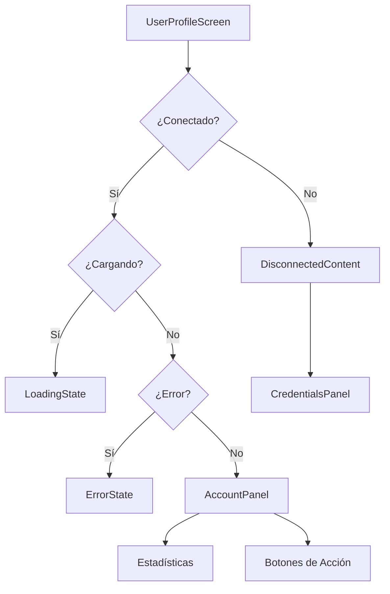

# UserProfileScreen

> Pantalla de perfil de usuario modularizada para gestión de cuentas VPN

## 📋 Descripción

UserProfileScreen es un componente modular que gestiona la visualización del perfil del usuario, incluyendo información de la cuenta, estado de conexión VPN, y configuración de credenciales. La arquitectura modular permite un mantenimiento más sencillo y mejor organización del código.

## 📁 Estructura del Módulo

```
UserProfileScreen/
├── components/                    # Componentes específicos del módulo
│   ├── AccountPanel.tsx          # Panel principal de información de cuenta
│   ├── DisconnectedContent.tsx   # Contenido mostrado cuando no hay conexión
│   └── UserProfileHeader.tsx     # Header personalizado con controles
├── hooks/
│   └── useUserProfile.ts         # Hook personalizado con lógica de estado
├── types/
│   └── index.ts                  # Tipos específicos del módulo
├── UserProfileScreen.tsx         # Componente principal
├── index.ts                      # Barrel exports
└── README.md                     # Este archivo
```

## 🔧 Componentes

### UserProfileScreen (Principal)
**Archivo**: `UserProfileScreen.tsx`

Componente principal que orquesta la pantalla de perfil de usuario.

```tsx
interface UserProfileScreenProps {
  // Props si son necesarias en el futuro
}
```

**Características**:
- Gestión de estado de conexión VPN
- Navegación entre estados conectado/desconectado
- Layout responsive con scroll optimizado
- Integración con sistema de navegación nativo

---

### AccountPanel
**Archivo**: `components/AccountPanel.tsx`

Panel que muestra la información completa de la cuenta del usuario cuando está conectado.

```tsx
interface AccountPanelProps {
  data: UserData;
  onContact: () => void;
  onRenew: () => void;
}
```

**Características**:
- Información de usuario (nombre, ID, región)
- Estado de la suscripción con indicadores visuales
- Estadísticas de conexiones activas vs límite
- Indicadores de vencimiento con alertas
- Botones de acción (renovar, contactar soporte)
- Grid de estadísticas rápidas
- Diseño con gradientes y sombras personalizadas

---

### UserProfileHeader
**Archivo**: `components/UserProfileHeader.tsx`

Header personalizado con información de estado y controles.

```tsx
interface UserProfileHeaderProps {
  isConnected: boolean;
  isLoading: boolean;
  onRefresh: () => void;
}
```

**Características**:
- Icono dinámico basado en estado de conexión
- Título contextual (Mi Cuenta / Configuración)
- Indicador de estado con StatusIndicator
- Botón de refresh cuando está conectado
- Respeta altura de status bar del dispositivo

---

### DisconnectedContent
**Archivo**: `components/DisconnectedContent.tsx`

Contenido mostrado cuando el usuario no está conectado a la VPN.

```tsx
interface DisconnectedContentProps {
  isConnecting: boolean;
}
```

**Características**:
- Panel informativo sobre seguridad de credenciales
- Integración con CredentialsPanel global
- Diseño con InfoPanel y Card
- Gradiente de fondo personalizado
- Mensaje educativo sobre encriptación

## 🎣 Hooks

### useUserProfile
**Archivo**: `hooks/useUserProfile.ts`

Hook personalizado que encapsula toda la lógica de estado y efectos del perfil de usuario.

**Estado gestionado**:
```tsx
{
  userData: UserData | null;
  isLoading: boolean;
  error: string | null;
  isConnected: boolean;
  isConnecting: boolean;
}
```

**Acciones disponibles**:
```tsx
{
  fetchUserData: () => void;
  handleContactSupport: () => void;
  handleRenew: () => void;
}
```

**Funcionalidades**:
- Fetching automático de datos de usuario
- Gestión de timeouts (30s)
- Cleanup de event listeners
- Integración con API nativa DTunnel
- Manejo de errores comprehensivo
- Auto-refresh basado en estado de conexión

## 📝 Tipos

### UserData
```tsx
interface UserData {
  username: string;
  expiration_date: string;        // Formato: DD/MM/YYYY
  expiration_days: number;        // Días restantes
  limit_connections: number;      // Límite de conexiones simultáneas
  count_connections: number;      // Conexiones activas actuales
  server_region: string;          // Región del servidor
  plan_type: string;             // Tipo de plan (Estándar, Premium, etc.)
  user_id: string;               // ID único del usuario
}
```

### UserProfileState
```tsx
interface UserProfileState {
  userData: UserData | null;
  isLoading: boolean;
  error: string | null;
}
```

## 🔄 Flujo de Estados



## 🚀 Uso

### Importación Básica
```tsx
import { UserProfileScreen } from './components/screens/UserProfileScreen';

// Uso
<UserProfileScreen />
```

### Importación de Componentes Específicos
```tsx
import { 
  AccountPanel,
  UserProfileHeader,
  useUserProfile 
} from './components/screens/UserProfileScreen';
```

## 🔗 Dependencias

### Internas
- `useVpnConnection` - Hook global para estado VPN
- `CredentialsPanel` - Componente global de credenciales
- `StatusIndicator`, `LoadingState`, `ErrorState` - Componentes UI globales
- `deviceUtils` - Utilidades para dimensiones del dispositivo
- `theme` - Sistema de colores y temas

### Externas
- `lucide-react` - Iconografía
- `react` - Hooks y componentes base

## 🎨 Diseño

### Paleta de Colores
- **Primary**: `colors.brand.primary` (#6d4aff)
- **Background**: `colors.background.primary/secondary`
- **Success**: `colors.status.success` (verde para download)
- **Warning**: `colors.status.warning` (ámbar para vencimiento)
- **Error**: `colors.status.error` (rojo para vencido)

### Espaciado
- **Padding container**: `px-6 py-4`
- **Gap components**: `space-y-6`
- **Cards**: `p-4` interno
- **Grid**: `gap-3` para estadísticas

## 🔧 Configuración

### Timeouts
- **Fetch user data**: 30 segundos
- **Auto-refresh**: Basado en estado de conexión

### URLs de Soporte
- **WhatsApp**: `https://wa.me/5493812531123`
- **Renovación**: Mismo enlace de WhatsApp

## 📱 Responsive

- **Mobile-first**: Diseño optimizado para móviles
- **Safe areas**: Respeta status bar y navigation bar
- **Scroll optimizado**: WebKit touch scrolling habilitado
- **Touch targets**: Botones con mínimo 44px de altura

## 🧪 Testing

Para testing, importar componentes específicos:

```tsx
import { useUserProfile } from './UserProfileScreen';
import { render } from '@testing-library/react';

// Test del hook
const { result } = renderHook(() => useUserProfile());
```

## 📚 Notas de Migración

### Desde Versión Monolítica
- ✅ `AccountPanel` movido desde `src/components/user/`
- ✅ Lógica extraída a `useUserProfile` hook
- ✅ Header separado en componente específico
- ✅ Tipos centralizados en `/types`
- ✅ Mantiene compatibilidad con imports existentes

### Breaking Changes
- Ninguno - la API pública permanece igual

---

**Creado**: Agosto 2025  
**Última actualización**: Agosto 2025  
**Versión**: 1.0.0
